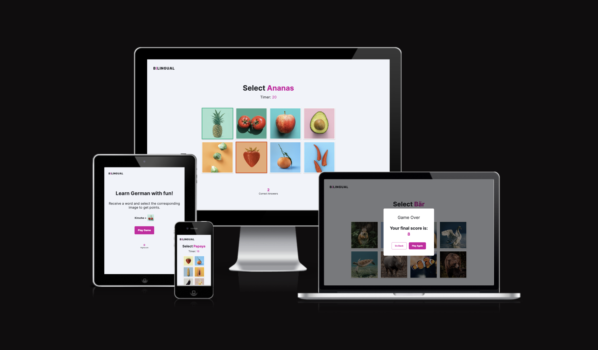
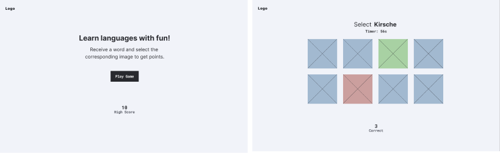
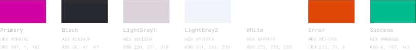
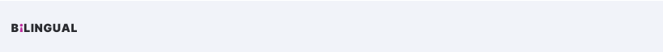
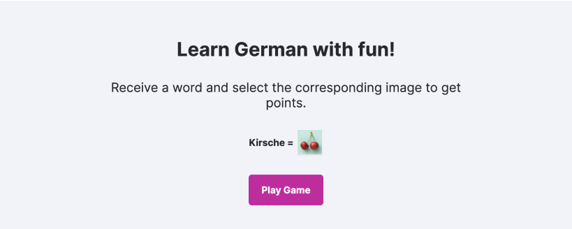
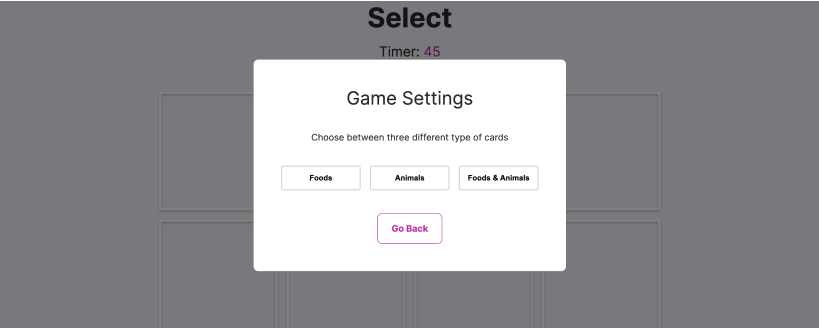
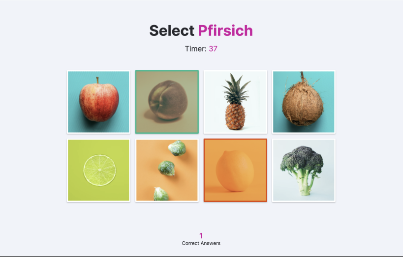
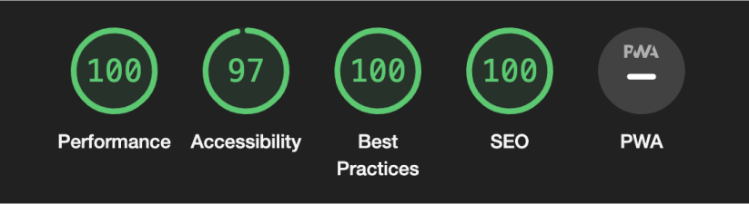
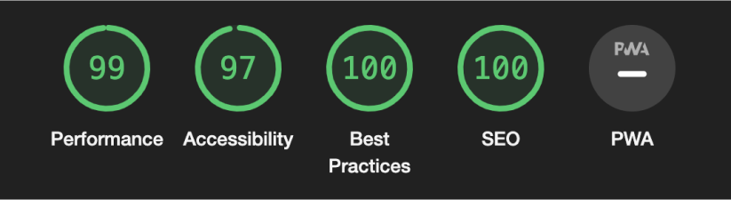

# BiLINGUAL

This is BiLINGUAL, a web app that helps you learn basic German vocabulary wrapped inside of a fun game! 

Although learning a new language is a great thing, it can oftentimes end up being a boring chore instead. Throughout the journey of learning a language, people spend most of their time trying to understand the grammar which often results in not having enough practice with the basic vocabulary needed to communicate in daily life.

BiLINGUAL was built to help with this endeavor. The users can learn German vocabulary by playing a simple but fun game.

[Link to the game](https://dev-timm.github.io/bilingual/)



## Product Decisions

### User Needs
As a person who...

- is learning a new language I want to master basic vocabulary quickly so that I can start interacting with native speakers.
- is encouraged by instant feedback on my actions I would like to quickly see what I’m doing wrong so that I stay motivated to practice.
- likes to track their own progress I’d like to compare my previous and current results so that I see how I improve over time.
- takes a language course where vocabulary is not covered extensively I want to expand my vocabulary so that I won’t be stressed in new situations.


### MVP
For the MVP it was important to have the basic concept of the game running. During the game round, users are offered a quiz-like question where they have to select the right image card according to the German word displayed at the top. The game is structured in such a way that in the future new languages and vocabulary categories can be added easily.

## Design Decisions

### Design Process
To make sure that the focus lies on the functionality, the design process of the game was first captured in low-fidelity mockups before adding visuals.



All wireframe can be found [here.](https://github.com/dev-timm/bilingual/tree/main/assets/images/readme/wireframes)

### Visual Design
The goal of a good visual design should be to support the structure of the UI so that the user can achieve their goals easily and with delight. Therefore, the visual design for this project was kept simple and clean with the aim of having more focus on important features.

#### Fonts
The font family [Inter](https://fonts.google.com/specimen/Inter?query=inter) was chosen as the most suitable font for BiLINGUAL. With its simplicity, Inter is a great addition to the game’s UI as it doesn’t attract too much attention but is still able to be used to highlight key textual information.

#### Colors
As images are the key factor of the game, the color palette was kept simple to make sure the emphasis remains on images themselves. As a result, the rest of the UI doesn’t attract too much attention while the user is engaged in the game. Critical information, however, is highlighted with a vibrant primary color so that the user doesn’t miss any important feedback.



#### Accessibility
The color palette has sufficient contrast and the font is well readable which ensures the game is accessible even to visitors with impaired vision.

## Features

### Header
The header is kept simple and only shows the logo on the top left as part of the navigation. By clicking the logo the user returns to the homepage.



### Intro
The intro section is the first thing that awaits the visitor when landing on the homepage. The headline gives a clear indication on what the user can expect from this web app. As part of the content there is a quick tutorial about how the game works and a button to start it.



### High Score
The high score section displays the highest amount of correct answers the user has given throughout all of the played rounds. The information is saved via local storage, so even when the user closes the browser, the high score will still be displayed when visiting the page again.


### Game Settings Modal
After clicking on the “Play Game” button on the homepage, users see the game settings modal which allows them to choose among three different categories. Selecting one of the categories will automatically start the game.



### Game Screen
The game screen shows 8 random cards which include images that are based on the category the user has selected. Above the card grid there is a prompt that asks the user to select the corresponding card, as well as there is a timer that runs down. If the user selects the right image, the card will turn green and a new random set of cards will appear. Clicking on the wrong card will turn it orange and highlight the correct card in green before loading the next prompt. There is a counter on the bottom that shows the number of correct answers the user has given in total during the current game round.



### Game Over Modal
The game over modal shows up as soon as the timer reaches 0. It notifies the user that the game has ended and displays the number of correctly given answers. It also gives the user the choice to start a new game or return to the homepage.


## Testing

All webpages were tested with an [HTML Validator](https://validator.w3.org/), [CSS Validator](https://jigsaw.w3.org/css-validator/) and a [JS Validator](https://jshint.com/) and no significant issues were found.

### Lighthouse
Each page of the deployed website has been tested multiple times with Google Chrome's Lighhouse feature to ensure all scores have been above 90 for both mobile and desktop devices.

#### Desktop



#### Mobile



### Tested Devices & Browsers
- iPhone 11
    - Safari
- Macbook Pro 2019 16-inch
    - Chrome
    - Safari
    - Firefox

### Feature Testing
| Feature | Action | Expected Behaviour | Pass/Fail
| --- | --- | --- | --- |
| Header | Click on logo | Opens homepage | Pass
| Intro | Click on "Play Game" button | Opens game page with settings modal | Pass
| High Score | Go to homepage after playing the game | Shows highest amount of correct answers | Pass
| High Score | Close website and open it again | Still shows the highest score from previous sessions | Pass
| Settings Modal | Click on "Foods" button | Starts game with food type cards | Pass
| Settings Modal | Click on "Animals" button | Starts game with animal type cards | Pass
| Settings Modal | Click on "Foods & Animals" button | Starts game with a mix of food and animal type cards | Pass
| Settings Modal | Click on "Go Back" button | Opens homepage | Pass
| Word Prompt | While playing the game | Question word changes randomly with every given answer | Pass
| Timer | Start the game | Timer counts down after starting the game until it reaches 0 which ends the game round | Pass
| Game Grid | Click on correct card | Card turns green and new prompt starts | Pass
| Game Grid | Click on wrong card | Card turns orange, correct card turns green and new prompt starts | Pass
| Game Grid | Click on more than one card before new prompt starts | Only first card is selected | Fail
| Correct Answers | Click on correct card | Increases correct answer amount by 1 | Pass
| Correct Answers | Click on wrong card | Correct answer amount not affected | Pass
| Game Over Modal | Timer reaches 0 | Shows the total number of correctly given answers | Pass
| Game Over Modal | Click on "Play Again" button | Shows the settings modal to start a new game | Pass
| Game Over Modal | Click on "Go Back" button | Opens homepage | Pass

### Currently Known Bugs

#### Select Multiple Cards
Currently it is possible to select more than one card before the next prompt starts. This can lead to the user first selecting the wrong card but then quickly selecting the right card before the cards will be randomized again. However, it is not possible to select the correct answer multiple times in order to gain more points. 

#### Unlimited Game Session
After the game has finished, the user can disable the game over modal via browser's developer tools and continue clicking on the cards and gain points. Since the game is built for personal use and doesn't offer any ranking among users, this is not a breaking bug and only affects the own score.

## Deployment

### Deploying the website to GitHub Pages:
1. Visit the GitHub page of the website’s repository.
2. Click on “Settings”.
3. Click on “Pages” inside the left sidebar.
4. Make sure “Deploy from a branch” is selected under the "Source" section.
5. Change branch from “None” to “main”.
6. Click on the "Save" button.
7. If everything's done right, in less than a minute a banner should appear on top of the same page containing the website's link (which is now hosted on GitHub Pages).
The link to the deployed website of this project can be found [here.](https://dev-timm.github.io/bilingual/)

### Cloning the repository
1. Visit the GitHub page of the website’s repository.
2. Click the “Code” button on top of the page.
3. Click on “HTTPS” below the “Clone” section.
4. Click on the copy button next to the link to copy it.
5. Open your IDE.
6. Type  ```git clone <copied URL>``` into the terminal.
7. If everything's done right, you should now see a cloned repository in your IDE.

## Credits 

### Images
- all images for the game are taken from [unsplash.com](https://unsplash.com/)
- the device preview image for the README.md is taken with the help of [ui.dev/amiresponsive](https://ui.dev/amiresponsive)

### Code
Solutions that helped me with:
- [shuffling the array](https://www.youtube.com/watch?v=5sNGqsMpW1E)
- [setting up a timer](https://www.youtube.com/watch?v=GhePFBkdNYk)
- [using local storage](https://www.youtube.com/watch?v=DFhmNLKwwGw)
- [understanding why eval() is a potential security risk and should be avoided](https://stackoverflow.com/questions/2573548/given-a-string-describing-a-javascript-function-convert-it-to-a-javascript-func)

### Thank You
- to my mentor Dick for supporting me with his feedback throughout the entire project
- to my wife Valentina for making sure I always get the time and anything else I need for working on this course and projects